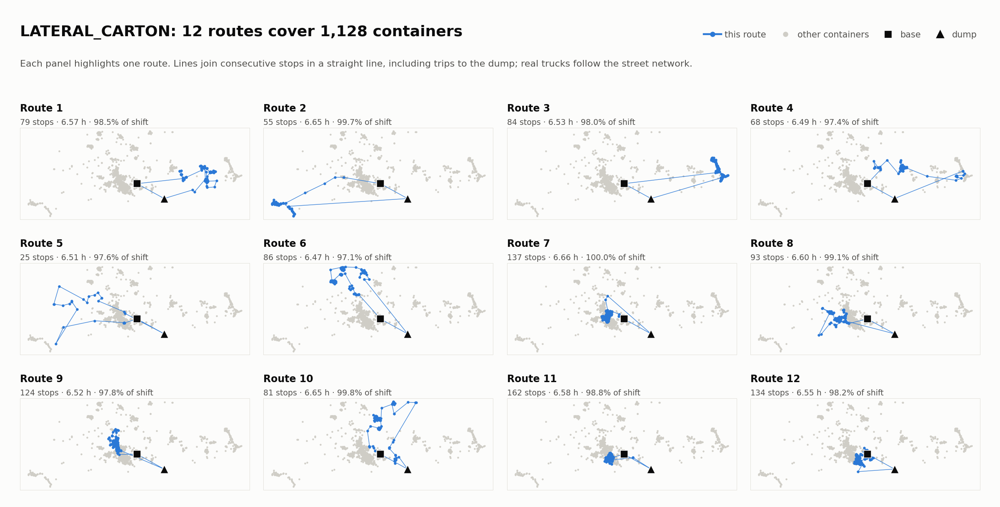
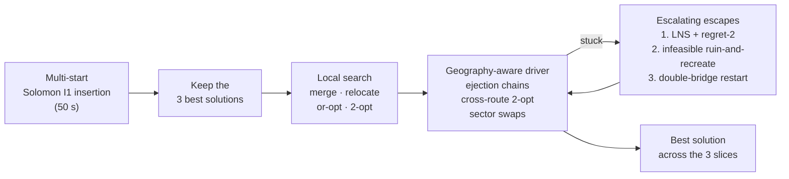

# SmartEcoRutas: routing Cartagena's waste-collection trucks

**Winning solution of [SmartEcoRutas](https://retos.upct.es/informacion/reto-smartecorutas), a Retos-UPCT 2026 challenge sponsored by Lhicarsa, the company that runs waste collection in Cartagena (Spain).** A rich vehicle-routing solver in pure Python + NumPy that plans every route for four real collection services, each with more than 1,000 containers, in 15 minutes per service.

*En español:* solución ganadora del reto SmartEcoRutas de Retos-UPCT 2026, patrocinado por Lhicarsa. Las bases originales del reto están en [docs/CHALLENGE.md](docs/CHALLENGE.md).

[Watch the video](https://youtu.be/A5iHcUB0uj4) · [Read the solver](student/algoritmoSmartEcoRutas.py) · [Challenge rules (ES)](docs/CHALLENGE.md)

<picture>
  <source media="(prefers-color-scheme: dark)" srcset="docs/img/routes_lateral_carton_dark.png">
  
</picture>

## Results

On `LATERAL_CARTON` (1,128 containers), run with the official protocol of 15 minutes and seed 0:

| | Routes | Total route time |
|---|---:|---:|
| Best starting solution (multi-start construction) | 13 | 82.3 h |
| Final solution | **12** | **78.8 h** |

The search deletes a whole route from the best construction and still cuts 3.5 hours of total route time. All 12 routes last between 97% and 100% of the 6 h 40 min working day: the trucks are packed to the limit, which is what minimising the number of routes demands. The solution and every intermediate stage are saved in [`extra_algorithm_output/`](extra_algorithm_output/).

## The problem

Each instance is one real collection service: a truck type and a waste stream, with the actual container locations of Cartagena and travel times computed on the OpenStreetMap road network.

| Instance | Truck and waste | Containers | Containers per dump trip | Service time per container |
|---|---|---:|---:|---:|
| `LATERAL_CARTON` | side loader, paper and cardboard | 1,128 | 362 | 65 s |
| `LATERAL_ENVASE` | side loader, packaging | 1,335 | 294 | 65 s |
| `LATERAL_RESTO` | side loader, residual waste | 2,392 | 94 | 65 s |
| `TRASERA_RESTO` | rear loader, residual waste | 1,591 | 168 | 80 s |

A solution is a set of routes such that:

- every container is collected exactly once;
- each route leaves the base and returns to it, and the last stop before returning is the dump;
- a truck must unload at the dump (30 minutes) once it has collected the number of containers its payload allows, and can do so several times in the same route;
- no route may last longer than the working day: **6 h 40 min**, service and unloading included.

The ranking is **lexicographic**: first the fewest routes, summed over the four instances; travel time only breaks ties. Each instance gets **15 minutes** of computation, with a 5-second tolerance.

## How the solver works

One principle drives every design decision: a solution with one route fewer beats any amount of saved travel time. So most of the search effort goes into **deleting routes**, and travel time is optimised in the gaps.



- **Many starts, then deep search.** Solomon I1 insertion is run with different seeds and weightings to get diverse starting points. Only the three best get search time, each in an equal slice of the remaining budget.
- **Deleting routes.** Ejection chains try to empty the smallest routes into their neighbours. When those stall, LNS removes the shortest route and reinserts its containers with regret-2 insertion, placing first the container that would lose most by waiting.
- **Allowing overtime on purpose.** When that fails too, an *infeasible ruin-and-recreate* removes a whole route, spreads its containers over the others even if some routes go over the 6 h 40 min limit, and then squeezes the overload out with 2-opt\*, relocations, swaps and merge-split moves, relaxing the acceptance rule when progress stalls. The aim is to reach solutions that moves which always stay feasible cannot get to. If even that fails, a double-bridge perturbation restarts the search from the best solution so far.
- **Cheap, local moves.** Each container keeps a list of its 35 nearest neighbours that limits where it can be moved, and sector swaps only offer a container to another route when it sits closer to that route's centre than to its own. Every move stays cheap, so many of them fit in the budget.
- **Anytime by design.** The deadline is checked throughout and a 2-second safety margin is kept, so the solver always returns its best valid solution within the official limit.

The full pipeline is documented at the top of [`student/algoritmoSmartEcoRutas.py`](student/algoritmoSmartEcoRutas.py).

## Run it

Python 3.11 or newer.

```bash
pip install -r requirements.txt

# Official protocol: 15 minutes per instance, seed 0
python run.py --no-geo

# Quicker try on one instance (2 minutes)
python run.py --instances LATERAL_CARTON --time-limit-min 2 --no-geo

# Redraw every figure in this README from the saved output
python visualize.py
```

`run.py` evaluates every solution and writes a report to `algorithm_output/<instance>/report.json`. Without `--no-geo` it also exports the routes for Google Earth (`.kmz`) and QGIS (`.gpkg`). The solver itself saves its final solution and the intermediate stages to `extra_algorithm_output/<instance>/`, which `visualize.py` reads.

## What is in this repository

| Path | What it is | Author |
|---|---|---|
| [`student/algoritmoSmartEcoRutas.py`](student/algoritmoSmartEcoRutas.py) | The solver, about 2,200 lines | Our team |
| [`visualize.py`](visualize.py) | The figures in this README | Our team |
| [`extra_algorithm_output/`](extra_algorithm_output/) | Solutions and pipeline snapshots from the run shown above | Our team |
| [`framework/`](framework/), [`run.py`](run.py) | Instance loader, evaluator and runner | Challenge kit (UPCT) |
| [`data/`](data/) | The four official instances | Challenge kit (UPCT) |
| [`docs/CHALLENGE.md`](docs/CHALLENGE.md) | Original challenge rules, in Spanish | Challenge kit (UPCT) |
| [`student/algoritmoSmartEcoRutas_simple_example.py`](student/algoritmoSmartEcoRutas_simple_example.py) | Didactic baseline provided with the kit | Challenge kit (UPCT) |

## Team

- **Pedro José Rodrigues Souza** · [LinkedIn](https://www.linkedin.com/in/pedrojrodriguess/)
- **Illia Pastushenko** · [LinkedIn](https://www.linkedin.com/in/illia-pastushenko/)

Students at the Universidad Politécnica de Cartagena.

## Credits and license

The challenge, its data and the kit (`framework/`, `run.py`, `data/` and the [original rules](docs/CHALLENGE.md)) come from the [Retos-UPCT](https://retos.upct.es) programme of the Universidad Politécnica de Cartagena; the kit was first published by Pablo Pavón Mariño. The challenge was sponsored by Lhicarsa. Container locations are based on real data; the organisers note that some values may have been altered for privacy and academic purposes.

The kit is released by UPCT under the [MIT License](LICENSE). Under the challenge rules, the teams are the authors and owners of their algorithms.
